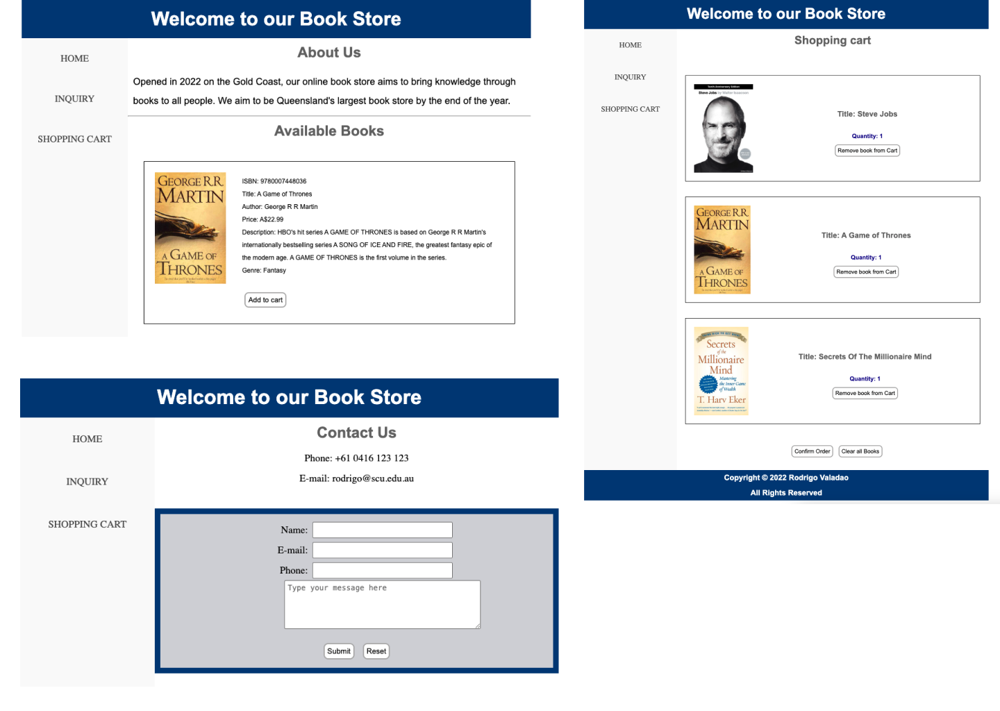

# Library Books

The **Library Books** project is a front-end practice website showcasing a cart and inquiry page for an online library. It focuses on design and layout using HTML, CSS, and JavaScript.

This project was developed as part of an **assessment activity** for my course at **Southern Cross University (SCU) Gold Coast**, as part of the **Bachelor of Information Technology** program.



🌐 [Live Demo](https://rodrigovaladao.github.io/library_books/cart.html)

## Features

- **Cart Page:** Displays a basic cart layout for selecting books.
- **Inquiry Page:** A form for users to make inquiries about the books.
- **Responsive Design:** Optimised for different screen sizes.

## Technologies Used

- **HTML5:** Structure of the web pages.
- **CSS3:** Styling and responsive layout.
- **JavaScript:** Basic interactivity.

## Installation

To view the project locally:

1. Clone the repository:
   ```bash
   git clone https://github.com/rodrigovaladao/library_books.git
   ```
